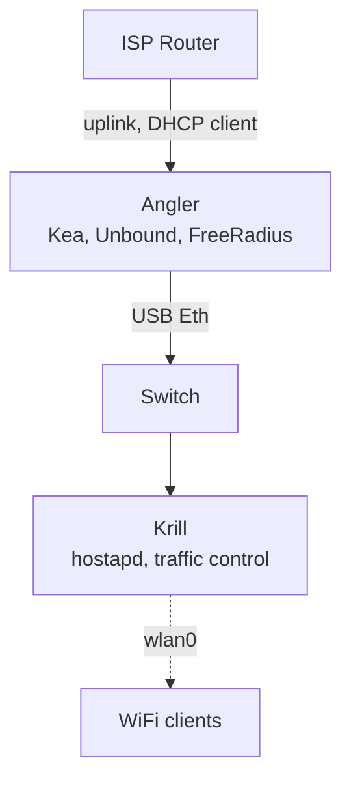

# Archipelago

Monorepo for my workstation and homelab: a network-focused infrastructure
built for learning low-level networking, routing protocols, eBPF, and access
control. All declared as code.

## Architecture



- **ISP router**: uplink only. DHCP, NAT, and DNS are delegated.
- **Angler**: default gateway for the private network. Routes, firewalls,
  authenticates, and observes.
- **Krill**: pure access layer. Bridges WiFi clients to the LAN.

## Observability

All telemetry converges on **Angler**:

System (CPU, mem, disk), with node_exporter in VictoriaMetrics
BGP sessions, with FRR Prometheus exporter in VictoriaMetrics
NetFlow/IPFIX, with GoFlow2 collector in VictoriaMetrics
DHCP leases, with Kea Prometheus endpoint in VictoriaMetrics
DNS queries, with Unbound Prometheus endpoint in VictoriaMetrics
eBPF/XDP stats, with custom exporter in VictoriaMetrics
Packet drops, with nftables log → Loki in VictoriaLogs
Blackbox probes, with blackbox_exporter in VictoriaMetrics

Grafana provides dashboards for BGP state, top talkers, traffic volumes,
DHCP pool usage, DNS performance, and firewall drops.

## Structure

```
bridge/             Alpine config (install.sh, hostapd, tc.qos...)
nix/
  flake.nix         Nix flake entry point
  hosts/
    angler/         NixOS: router, firewall, observability
    orca/           NixOS: daily driver workstation
  modules/
    core/           Base system settings (locale, nix...)
    desktop/        Desktop related (GNOME, gaming...)
    hardware/       Hardware-specific (TLP...)
    home/           Home-manager user configs
    network/        DNS, Kea, traffic control, eBPF
    security/       Audit, AppArmor, 802.1X
    services/       FRR, FreeRADIUS, Grafana, GoFlow2
    profiles/       Minimal/headless presets
.github/workflows/  CI (shellcheck, nftables validation, nix flake check)
```
