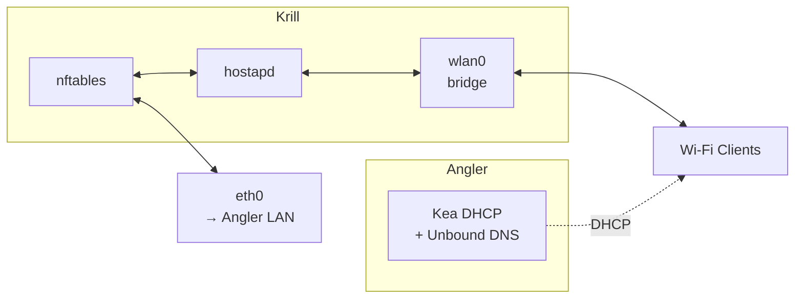

This script configures Krill as a lightweight Wi-Fi access point. DHCP, DNS, and routing are delegated to ***Angler***.

## Architecture



Krill is a pure access layer: it bridges WiFi to the LAN and lets Angler handle all network services (routing, firewall, DHCP, DNS, observability).

## Prerequisites

- Alpine Linux fresh install
- Angler reachable on the LAN side
- Wi-Fi card capable of AP mode (confirm with `iw list | grep "Supported interface modes" -A5`)

## Installation

1. **Configure secrets**
   ```
   cp secrets.env.example secrets.env
   vi secrets.env
   ```
   Set your device's static IP, gateway, and Wi-Fi password.

2. **Install**
   ```
   doas sh install.sh
   ```

## Files

```
.
├── etc
│   ├── hostapd
│   │   └── hostapd.conf
│   ├── init.d
│   │   └── krill-tc
│   ├── logrotate.d
│   │   └── krill
│   ├── network
│   │   └── interfaces
│   ├── nftables.nft
│   └── tc.qos
├── health
│   ├── checks/
│   └── handlers/
├── install.sh
├── LICENSE
├── README.md
└── secrets.env.example
```

## Services

**hostapd**: Turns `wlan0` into a Wi-Fi AP (SSID, channel, WPA2).

**nftables**: Minimal firewall — management access only.

**Traffic control**: HTB hierarchy for QoS on `eth0`.

## Maintenance

```sh
# Check service status
rc-service hostapd status
rc-service nftables status

# Verify Wi-Fi interface
iw dev wlan0 info

# Inspect firewall rules
nft list ruleset
```
